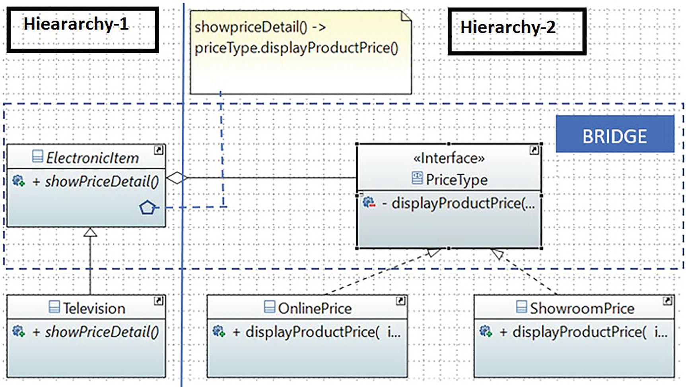

# Prototype Pattern

## Definition

It decouples an abstraction from its implementation so that the two can vary independently.

## Concept

This pattern is also known as the Handle/Body pattern. Using it, you decouple an implementation class from an abstract class by providing a bridge between them.

This bridge interface makes the functionality of concrete classes independent from the interface implementer classes. You can alter different kinds of classes structurally without affecting each other.
## Class Diagram

