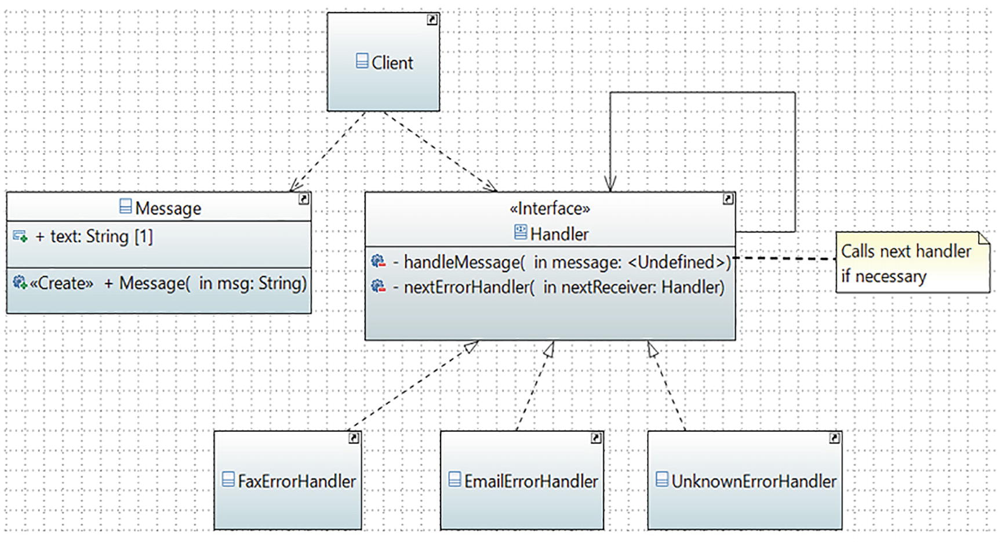

# Chain of Responsibility Pattern

## Definition

It avoids coupling the sender of a request to its receiver by giving more than one object a chance to handle the request. It chains the receiving objects and passes the request along the chain until an object handles it.
## Concept

In this pattern, you form a chain of objects where you pass the responsibility of a task from one object to another and so forth until an object accepts the responsibility of completing the task. Each object in the chain can handle a particular kind of request. If an object cannot handle the request fully, it passes the request to the next object in the chain. This process may continue until the end of the chain. This kind of request-handling mechanism gives you the flexibility to add a new processing object (handler) or shuffle their order in the chain.
## Class Diagram

