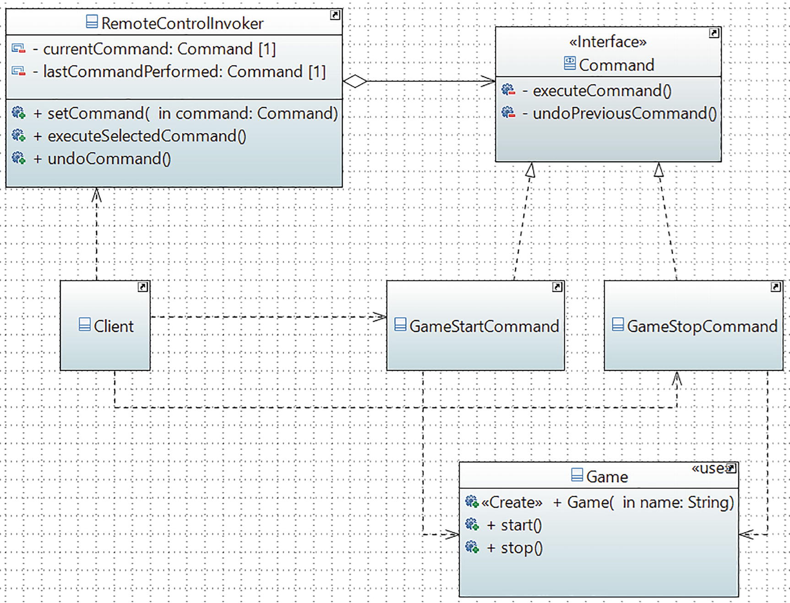

# Command Pattern

## Definition

It encapsulates a request as an object, thereby letting you parameterize clients with different requests, queue or log requests, and support undoable operations.
## Concept

Using this pattern, you encapsulate a method invocation process. Here an object can invoke an operation through some crystalized method, and it does not worry about how to perform the intended operation. This pattern is often used in a multithreaded environment. 
## Class Diagram

