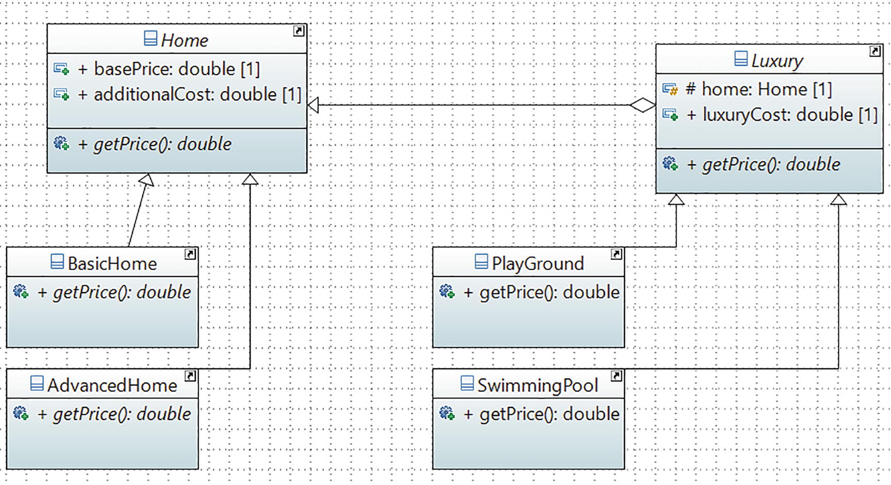

# Decorator Pattern

## Definition

It attaches additional responsibilities to an object dynamically. Decorators provide a flexible alternative to subclassing for extending functionality.
## Concept

An alternative to inheritance is composition. It is quite common in programming and often gives you a better payoff. This chapter shows a useful case study on this topic using some wrappers.

So, what is a wrapper(or a decorator)? A wrapper is like a topping that surrounds an object. The enclosing object is often called a decorator, which conforms to the interface of the component that it decorates. In programming, you often use a wrapper to add functionalities dynamically. This is a powerful technique because you can add or discard a wrapper as per your need, and it does not hamper the functionalities of the original object.
This pattern is most effective when you add decorators dynamically. It’s interesting to note since decorators are often added dynamically, it is perfectly fine if you do not want them in a later phase of development, because the original object can still work for you.
## Class Diagram

