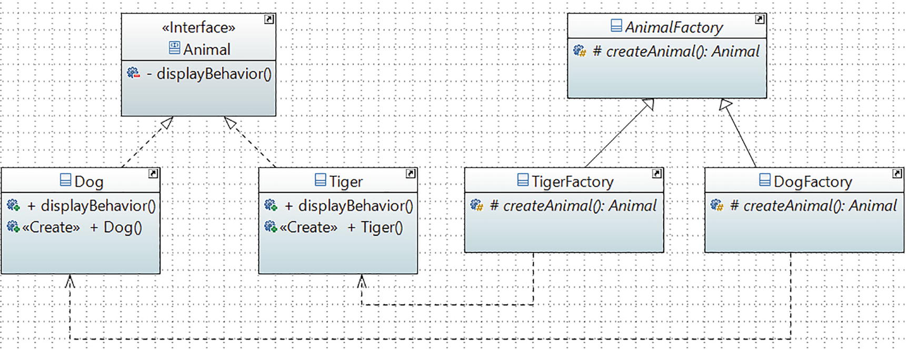

# Factory Method Pattern

## Definition

It defines an interface for creating an object, but lets subclasses decide which class to instantiate. The Factory Method pattern lets a class defer instantiation to subclasses.

## Concept

Here you start with an abstract creator class (often called a creator) that defines the basic structure of an application, and the subclasses (that derive from this abstract class) take the responsibility of doing the actual instantiation process. The concept will make sense to you when you analyze the following examples.

## Class Diagram

