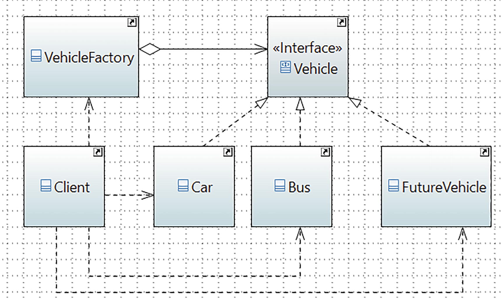

# Prototype Pattern

## Definition

It specifies the kinds of objects to create using a prototypical instance and creates new objects by copying this prototype.
## Concept

This pattern provides an alternative method for instantiating new objects by copying or cloning an instance of an existing object. Thus, you can avoid the expense of creating a new instance using this concept. 

## Class Diagram

