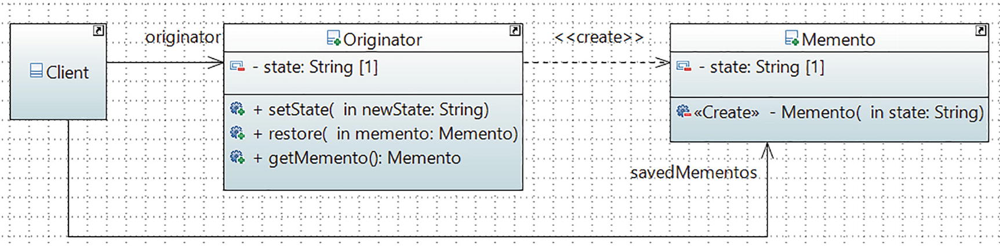

# Memento Pattern

## Definition

Without violating encapsulation, the Memento pattern captures and externalizes an object’s internal state so that the object can be restored to this state later.
## Concept

As per the dictionary, the word memento is used as a reminder of past events. Following the object-oriented way, you can also track (or save) the states of an object. So, whenever you want to restore an object to its previous state, you can consider using this pattern.

In this pattern, you commonly see three participants called memento, originator, and caretaker (often used as a client). The workflow can be summarized as follows: the originator object has an internal state, and a client can set a state in it. To save the current internal state of the originator, a client (or caretaker) requests a memento from it. A client can also pass a memento (which it holds) back to the originator to restore a previous state. Following the proper approach, these saving and restoring operations do not violate encapsulation.
## Class Diagram

