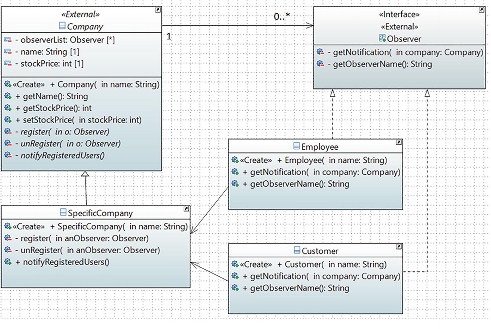

# Observer Pattern

## Definition

It defines a one-to-many dependency between objects so that when one object changes state, all its dependents are notified and updated automatically.
## Concept

In this pattern, there are two types of objects. One is an observer and the other is the subject. What is an observer? In simple words, it is an object that needs to be informed when interesting stuff happens in another object. The object about whom an observer is interested is called the subject.

Normally many observers observe a particular subject. Since the observers are interested in the changes in a subject, they register themselves to get the notifications from the subject. When they lose interest in the subject, they simply unregister from the subject. Sometimes this model is referred to as the Publisher-Subscriber (Pub-Sub) model.

The whole idea can be summarized as follows: using this pattern, an object (subject) can send notifications to multiple observers (a set of objects) at the same time. Observers can decide how to respond/react to these notifications. 
## Class Diagram

