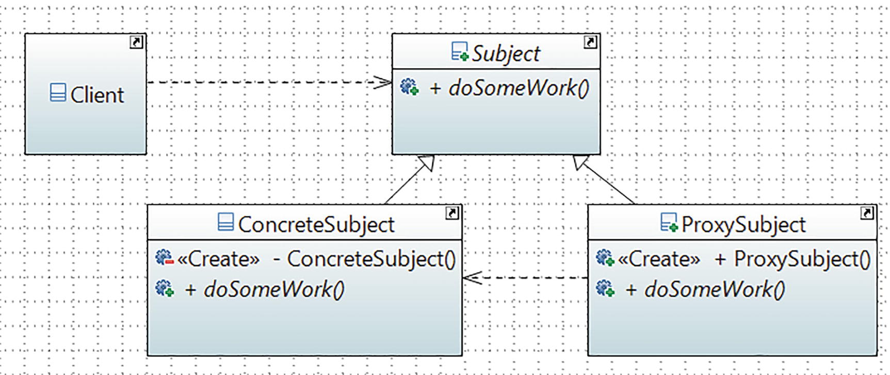

# Proxy Pattern

## Definition

It provides a surrogate or placeholder for another object to control access to it.

## Concept

There are situations where you want to restrict direct communication between an intended object and the outside world.
Proxies can be of different types, but fundamentally they are substitutes (or placeholders) for an original object. As a result, when a client interacts with a proxy object, it appears that it is directly talking to the actual object. So, using this pattern, you may want to use a class that can perform as an interface to the original one.

## Class Diagram

