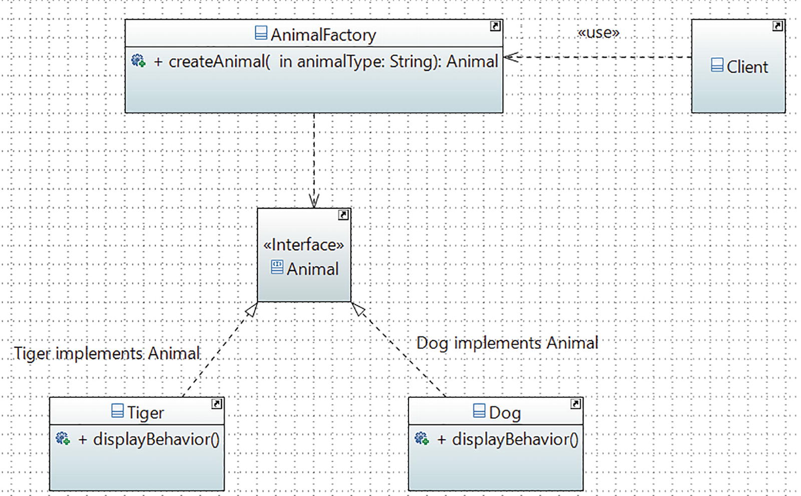

# Simple Factory Pattern

## Definition

It creates an object without exposing the instantiation logic to the client.

## Concept

In object-oriented programming, a factory is an object that can create other objects. A factory can be invoked in many different ways, but most often it uses a method that can return objects with varying prototypes. Any subroutine that can help you create these new objects can be considered as a factory. Most importantly, it helps you abstract the process of object creation from the consumers of the application.

## Class Diagram

