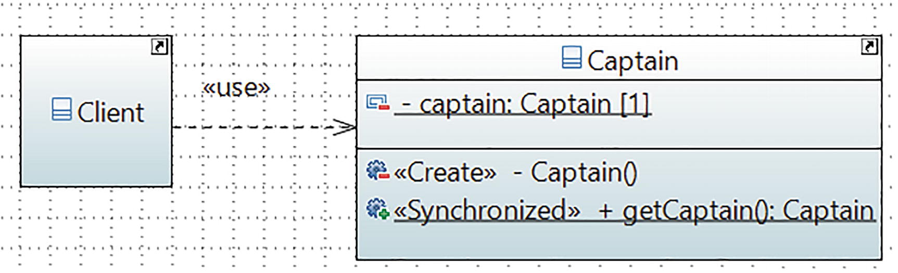

# Singleton Pattern

## Definition
It ensures that a class has only one instance and provides a global point of access to it.

## Concept

It restricts the use of new like this and ensures that you do not have more than one instance of the class.

In short, this pattern says that a particular class should have only one instance. You can create an instance if it is not available; otherwise, you should use an existing instance to serve your need. Following this approach, you can avoid creating multiple objects.
## Class Diagram

