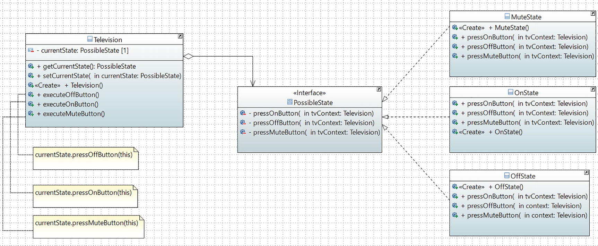

# State Pattern

## Definition

It allows an object to alter its behavior when its internal state changes. The object will appear to change its class.
## Concept

The GoF definition is easy to understand. It states that an object can change what it does and this depends on its current state.
## Class Diagram

