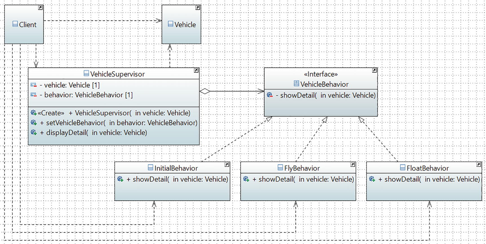

# Strategy Pattern

## Definition

It defines a family of algorithms, encapsulates each one, and makes them interchangeable. The Strategy pattern lets the algorithm vary independently from the clients that use it.

## Concept

A client can select an algorithm from a set of algorithms dynamically at runtime. This pattern also provides a simple way to use the selected algorithm.

You know that an object can have states and behaviors. And some of these behaviors may vary among the objects of a class. This pattern focuses on the changing behaviors that can be associated with an object at a specific time.

In this example, you will see a Vehicle class. Once a Vehicle instance is created, you can add and set behaviors to this object. Inside the client code, you can replace the current behavior with a new behavior, too. Most interestingly, you will see that since the behaviors can be changed, the vehicle class does NOT define the behavior; it simply delegates the task to a particular object referenced by a vehicle. 
## Class Diagram

