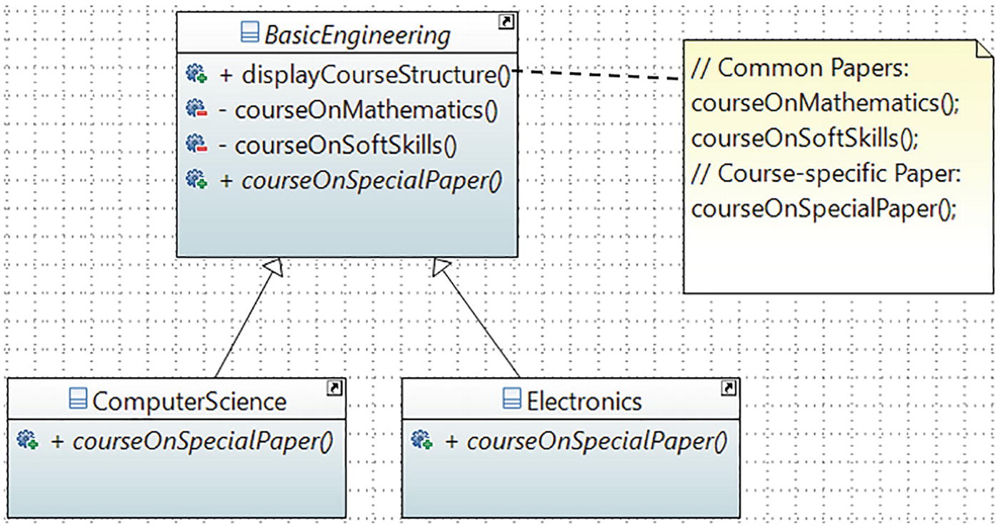

# Template Method Pattern

## Definition

It defines the skeleton of an algorithm in an operation, deferring some steps to subclasses. The Template Method pattern lets subclasses redefine certain steps of an algorithm without changing the algorithm’s structure.
## Concept

Using this pattern, you begin with the minimum or essential structure of an algorithm. Then you defer some responsibilities to the subclasses. As a result, the derived class can redefine some steps of an algorithm without changing the flow of the algorithm.

Simply put, this design pattern is useful when you implement a multistep algorithm but allow customization through subclasses. Here you keep the outline of the algorithm in a separate method referred to as a template method . The container class of this template method is often referred to as the template class.

It is important to note that some amount of implementation may not vary across the subclasses. As a result, you may see some default implementations in the template class. Only the specific details are implemented in a subclass. So, using this approach, you write a minimum amount of code in a subclass.
This bridge interface makes the functionality of concrete classes independent from the interface implementer classes. You can alter different kinds of classes structurally without affecting each other.
## Class Diagram

