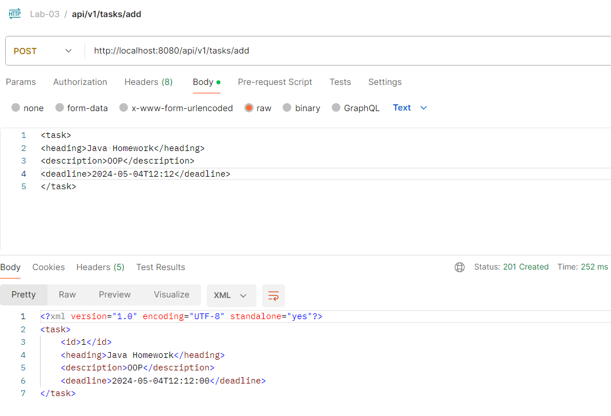
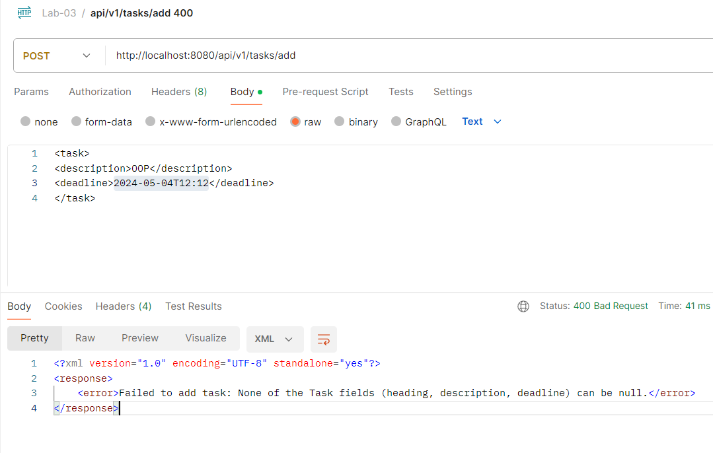
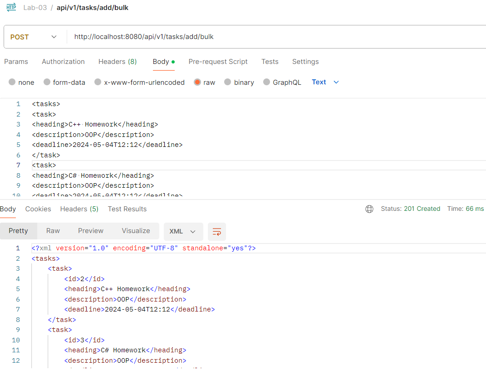
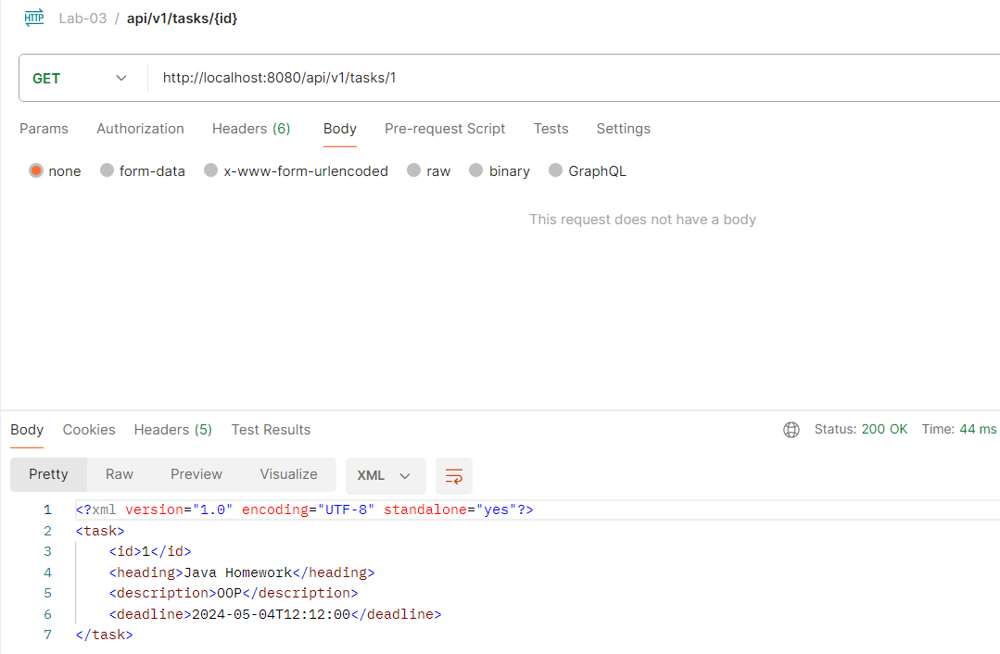
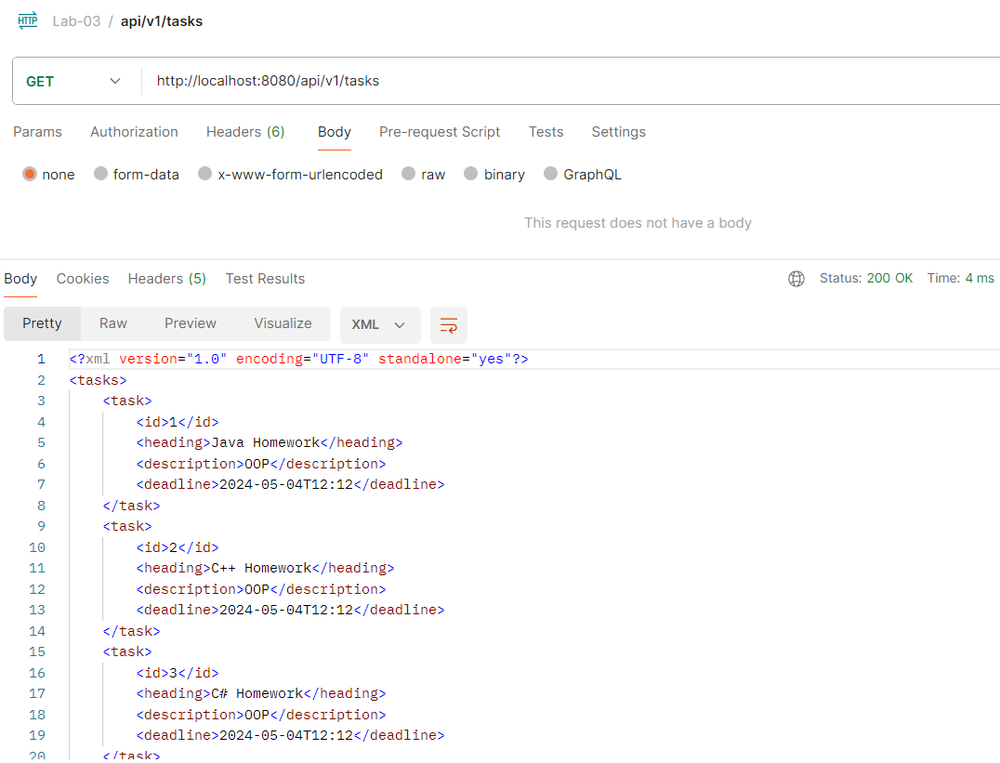
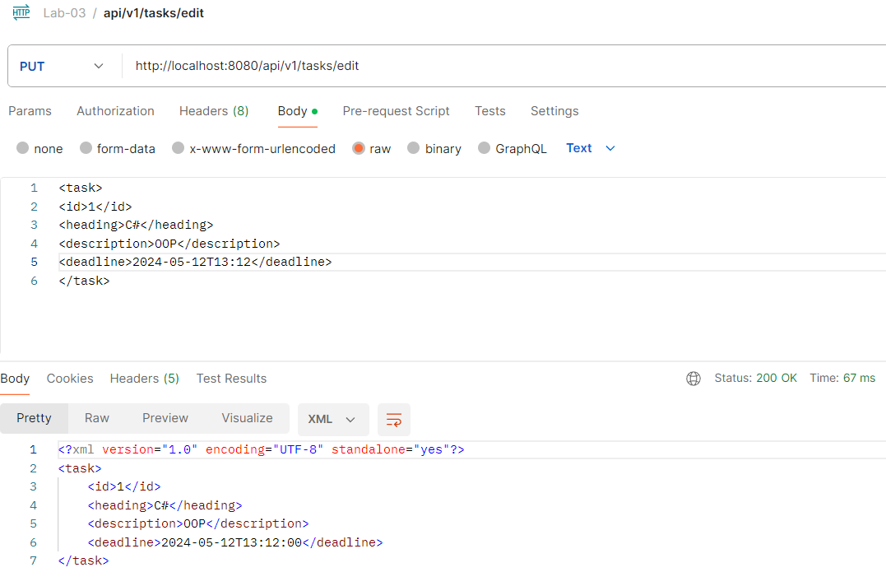
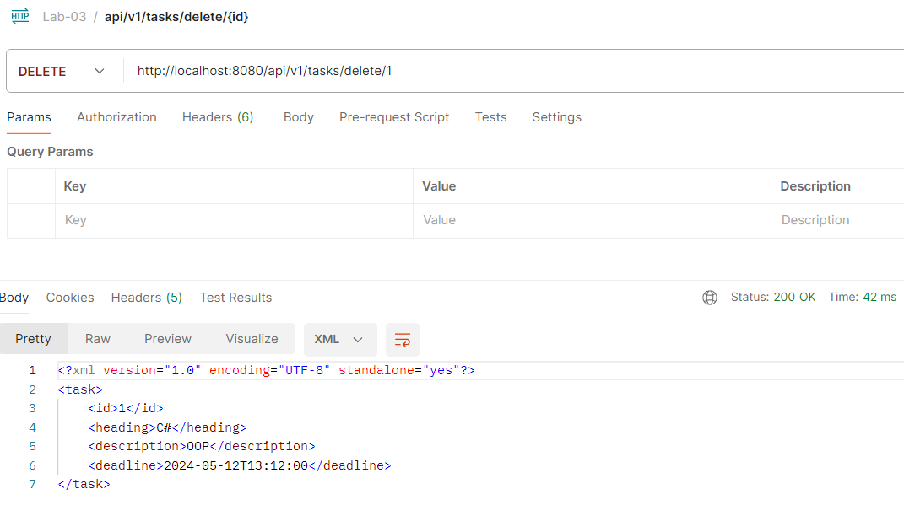

# Tasks API with Tomcat and Java Servlets

Base path is /api/v1/tasks.

Below are examples of GET, POST, PUT and DELETE requests.

The payload and response should be handled in XML format.

All requests can be found in the Lab-03.postman_collection.json

