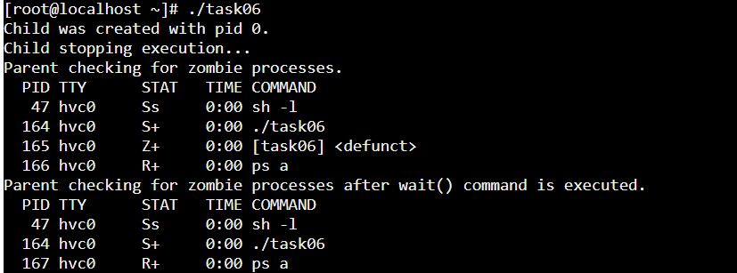
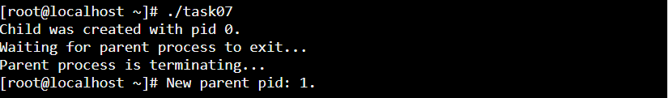

### Task 05
In C, the ampersand (&) is used as the address-of operator. When placed before a variable, it gives the memory address of that variable.

### Task 06

Defunct ("zombie") processes are child processes that have terminated, but have not been reaped by the parent.

### Task 07

