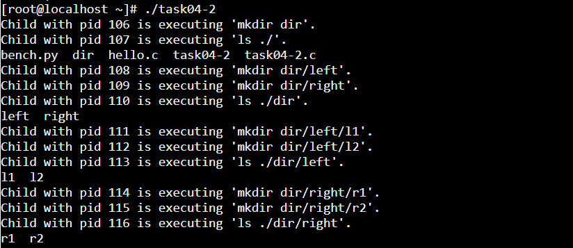
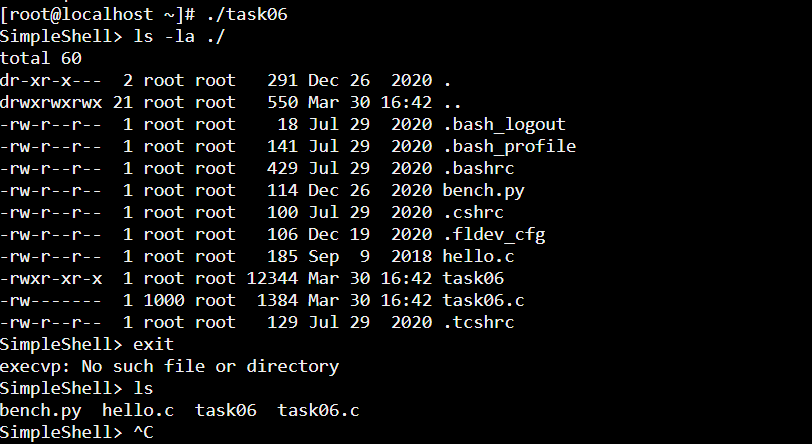

### Task 04

### Task 05
When you use fork() in a C program to create a new process, the fork() system call returns twice: once in the parent process and once in the child process that it creates. The value that fork() returns helps you differentiate between these two processes:

In the child process, fork() returns 0. This is how the child process knows that it's the child. When you're checking if pid == 0, you're effectively asking, "Am I the child process?" This condition is used to branch the logic so that the child process can execute code that is intended for it, often involving executing a different program with one of the exec family of functions.

In the parent process, fork() returns the PID (Process ID) of the newly created child process. This PID is a positive integer, and it allows the parent process to keep track of its child processes, perform operations like waiting for the child process to terminate, or sending signals to it.

### Task 06
