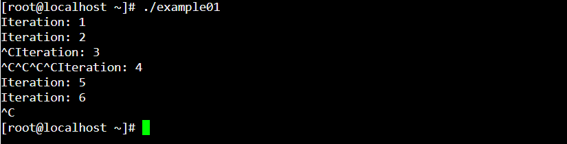
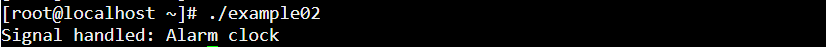
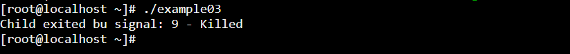
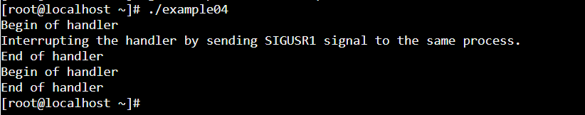
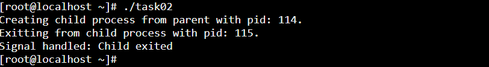
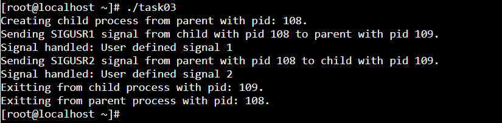

### Example 01

### Example 02

### Example 03

### Example 04
The SIGUSR1 and SIGUSR2 signals are set aside for you to use any way you want. They're useful for simple interprocess communication, if you write a signal handler for them in the program that receives the signal.

### Task 02

### Task 03

