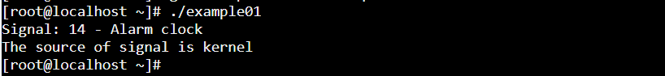
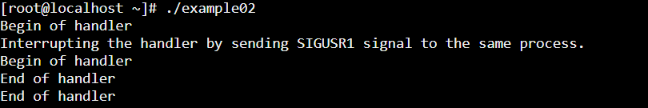
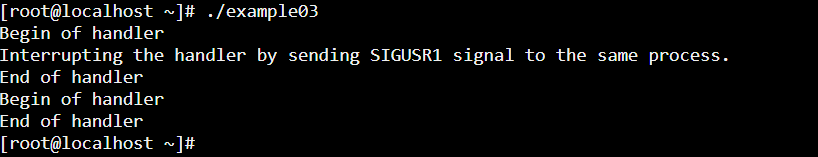
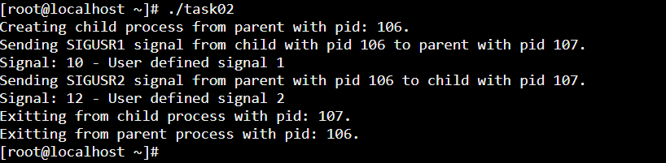
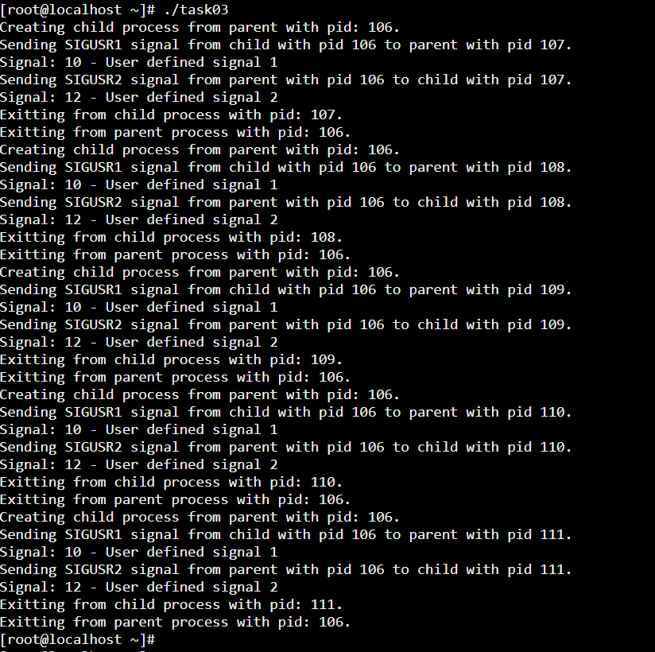

### Example 01

`memset(&sa, 0, sizeof(sa));` initializes all bytes of the struct sigaction sa to 0. 
This is a common technique in C programming to ensure that all fields of a structure are 
initialized to a known value before the structure is used. In the context of setting up 
signal handling with sigaction, initializing the struct sigaction to zero is particularly 
important because it ensures that all unused flags and fields within the structure are set to 0, 
preventing unexpected behavior due to uninitialized values.

### Example 02

### Example 03

### Task 02

### Task 03

