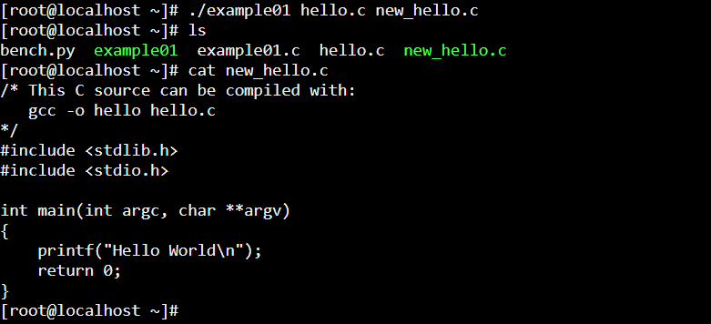
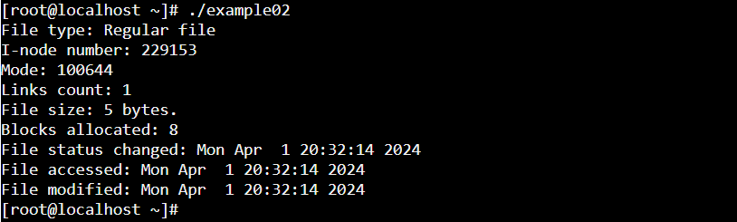
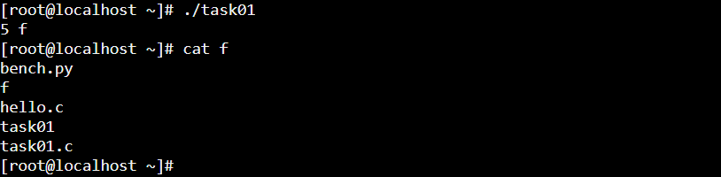
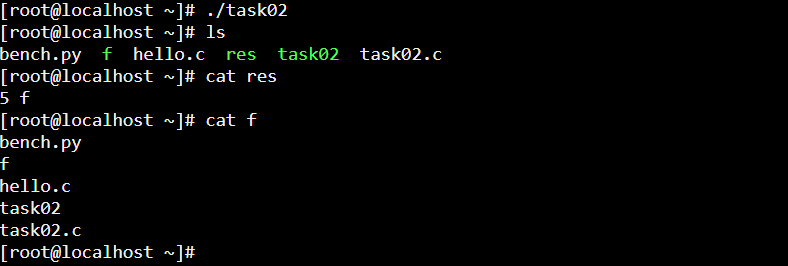

### Example 01
File descriptors or file handles are integer identifiers that specify data structures. 
The Linux kernel refers to these structures as file structs since they describe open files. 
The index of a file struct is the file handle. 
In Linux, each process has its own set of open files. 
Hence, each process also has its own table of file structs that the kernel keeps track of. 
Notably, each file struct is allocated in kernel memory. 
As such, the kernel can only allocate so many file structs until the system runs out of memory. 

### Example 02
`info.st_mode & S_IFMT`: The bitwise AND operation is used here to mask out the file 
type bits from st_mode. The result of this operation is a value that represents 
the file type, which can then be compared against other constants 
(like S_IFREG for regular files, S_IFDIR for directories, etc.) to determine 
the type of the file.

### Task 01

When you execute `dup2(writeFd, STDOUT_FILENO)`, it does the following:

- Closes `STDOUT_FILENO` if Necessary: If `STDOUT_FILENO` is already open (which it almost 
always is, as it's opened by default for any process), dup2 will close it before  duplicating. This step ensures that the standard output stream is ready to be replaced  without leaking file descriptors.

- Duplicates `writeFd` onto `STDOUT_FILENO`: It makes STDOUT_FILENO refer to the same open 
file table entry as writeFd. This means any write operations that would normally go to the 
standard output now go to the file writeFd is associated with.

- Result: After this operation, any output (e.g., from printf, puts, or any other library 
function that writes to stdout) will go directly to the file you opened and referred to by 
writeFd instead of appearing on the terminal.

`saveStdout` is used to save the original STDOUT_FILENO before any redirection. 
Later, `dup2(saveStdout, STDOUT_FILENO)` is used to restore stdout to its original state. 

### Task 02

